# Отчёт по ЛР 1: Loki + Zabbix + Grafana

## Часть 1: Логирование

### Шаг 1: Поднимаем все сервисы через docker-compose

Создаём файл `docker-compose.yml`:

```yaml
services:
  nextcloud:
    image: nextcloud:29.0.6
    container_name: nextcloud
    ports:
      - "8080:80"
    volumes:
      - nc-data:/var/www/html/data

  loki:
    image: grafana/loki:2.9.0
    container_name: loki
    ports:
      - "3100:3100"
    command: -config.file=/etc/loki/local-config.yaml

  promtail:
    image: grafana/promtail:2.9.0
    container_name: promtail
    volumes:
      - nc-data:/opt/nc_data
      - ./promtail_config.yml:/etc/promtail/config.yml
    command: -config.file=/etc/promtail/config.yml

  grafana:
    environment:
      - GF_PATHS_PROVISIONING=/etc/grafana/provisioning
      - GF_AUTH_ANONYMOUS_ENABLED=true
      - GF_AUTH_ANONYMOUS_ORG_ROLE=Admin
      - GF_INSTALL_PLUGINS=alexanderzobnin-zabbix-app
    command: /run.sh
    image: grafana/grafana:7.5.17
    container_name: grafana
    ports:
      - "3000:3000"

  postgres-zabbix:
    image: postgres:15
    container_name: postgres-zabbix
    environment:
      POSTGRES_USER: zabbix
      POSTGRES_PASSWORD: zabbix
      POSTGRES_DB: zabbix
    volumes:
      - zabbix-db:/var/lib/postgresql/data
    healthcheck:
      test: ["CMD", "pg_isready", "-U", "zabbix"]
      interval: 10s
      retries: 5
      start_period: 5s

  zabbix-server:
    image: zabbix/zabbix-server-pgsql:ubuntu-6.4-latest
    container_name: zabbix-back
    ports:
      - "10051:10051"
    depends_on:
      - postgres-zabbix
    environment:
      POSTGRES_USER: zabbix
      POSTGRES_PASSWORD: zabbix
      POSTGRES_DB: zabbix
      DB_SERVER_HOST: postgres-zabbix

  zabbix-web-nginx-pgsql:
    image: zabbix/zabbix-web-nginx-pgsql:ubuntu-6.4-latest
    container_name: zabbix-front
    ports:
      - "8082:8080"
    depends_on:
      - postgres-zabbix
    environment:
      POSTGRES_USER: zabbix
      POSTGRES_PASSWORD: zabbix
      POSTGRES_DB: zabbix
      DB_SERVER_HOST: postgres-zabbix
      ZBX_SERVER_HOST: zabbix-back

volumes:
  nc-data:
  zabbix-db:
```

**Важно**: Изначально пытались использовать Grafana 11.2.0, но столкнулись с проблемой несовместимости с плагином Zabbix (ошибка `Invalid parameter "user": unexpected parameter "user"`). После нескольких попыток откатились на Grafana 7.5.17, которая стабильно работает с плагином.

### Шаг 2: Настройка Promtail

Создаём файл `promtail_config.yml`:

```yaml
server:
  http_listen_port: 9080
  grpc_listen_port: 0

positions:
  filename: /tmp/positions.yaml

clients:
  - url: http://loki:3100/loki/api/v1/push

scrape_configs:
  - job_name: system
    static_configs:
      - targets:
          - localhost
        labels:
          job: nextcloud_logs
          __path__: /opt/nc_data/*.log
```

### Шаг 3: Запускаем все контейнеры

```bash
docker-compose up -d
```

Проверяем, что все контейнеры запустились:

```bash
docker ps
```

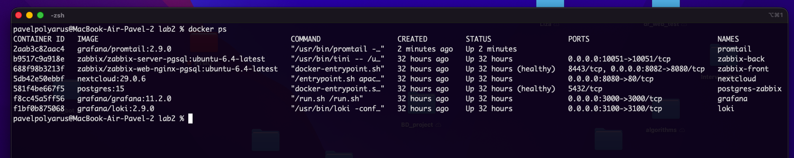

### Шаг 4: Инициализация Nextcloud

Заходим в браузере на `http://localhost:8080`, создаём учётную запись администратора (логин: `admin`, пароль: `admin`).

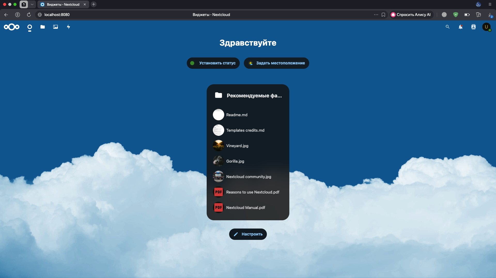

### Шаг 5: Проверка логов Nextcloud

Смотрим, что Nextcloud начал писать логи:

```bash
docker exec -it nextcloud bash
cat /var/www/html/data/nextcloud.log
exit
```

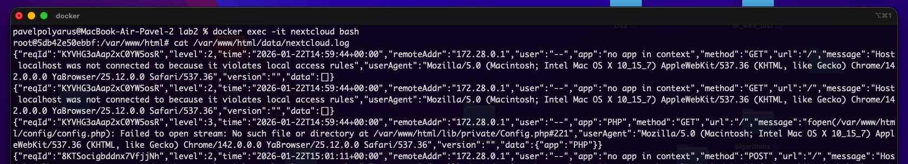

### Шаг 6: Проверка работы Promtail

Проверяем, что Promtail подхватил лог-файл:

```bash
docker logs promtail
```

Должны увидеть строку с `msg=Seeked /opt/nc_data/nextcloud.log`.

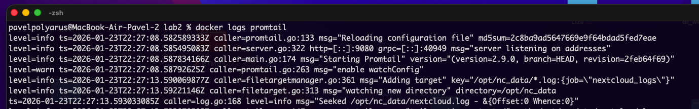

---

## Часть 2: Мониторинг

### Шаг 1: Создание шаблона мониторинга для Zabbix

Создаём файл `template.yml`:

```yaml
zabbix_export:
  version: '6.4'
  template_groups:
    - uuid: a571c0d144b14fd4a87a9d9b2aa9fcd6
      name: Templates/Applications
  templates:
    - uuid: a615dc391a474a9fb24bee9f0ae57e9e
      template: 'Test ping template'
      name: 'Test ping template'
      groups:
        - name: Templates/Applications
      items:
        - uuid: a987740f59d54b57a9201f2bc2dae8dc
          name: 'Nextcloud: ping service'
          type: HTTP_AGENT
          key: nextcloud.ping
          value_type: TEXT
          trends: '0'
          preprocessing:
            - type: JSONPATH
              parameters:
                - $.body.maintenance
            - type: STR_REPLACE
              parameters:
                - 'false'
                - healthy
            - type: STR_REPLACE
              parameters:
                - 'true'
                - unhealthy
          url: 'http://{HOST.HOST}/status.php'
          output_format: JSON
          triggers:
            - uuid: a904f3e66ca042a3a455bcf1c2fc5c8e
              expression: 'last(/Test ping template/nextcloud.ping)="unhealthy"'
              recovery_mode: RECOVERY_EXPRESSION
              recovery_expression: 'last(/Test ping template/nextcloud.ping)="healthy"'
              name: 'Nextcloud is in maintenance mode'
              priority: DISASTER
```

**Важно**: Первая версия файла содержала ошибку — секция `triggers` была на неправильном уровне вложенности. Исправили, переместив её внутрь `items`.

### Шаг 2: Вход в Zabbix

Заходим на `http://localhost:8082`, логин: `Admin`, пароль: `zabbix`.

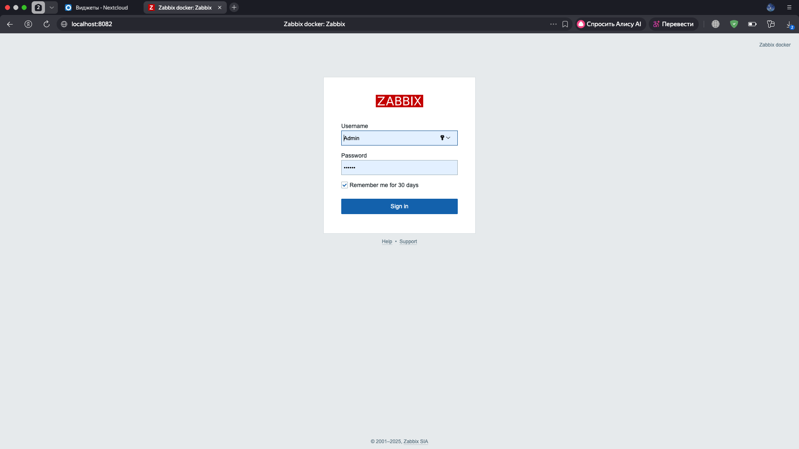

### Шаг 3: Импорт шаблона

Идём в **Data collection → Templates → Import**, выбираем файл `template.yml` и импортируем.

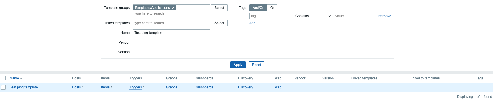

### Шаг 4: Настройка доверенного домена в Nextcloud

Чтобы Zabbix мог обращаться к Nextcloud по имени контейнера, добавляем его в доверенные домены:

```bash
docker exec -u www-data -it nextcloud bash
php occ config:system:set trusted_domains 1 --value="nextcloud"
exit
```

### Шаг 5: Добавление хоста в Zabbix

Идём в **Data collection → Hosts → Create host**, заполняем:
- **Host name:** `nextcloud`
- **Visible name:** `Nextcloud Service`
- **Groups:** `Applications`
- **Templates:** добавляем `Test ping template`

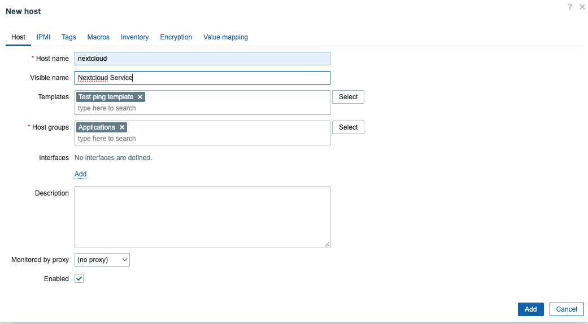

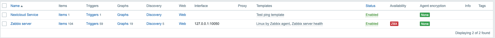

### Шаг 6: Проверка сбора данных

Ждём 1-2 минуты, идём в **Monitoring → Latest data**, выбираем хост `Nextcloud Service`. Видим метрику со значением `healthy`.

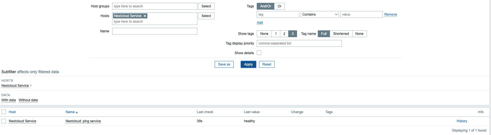

### Шаг 7: Проверка триггера

Включаем maintenance mode:

```bash
docker exec -u www-data -it nextcloud bash
php occ maintenance:mode --on
exit
```

Через 1-2 минуты в **Monitoring → Problems** появляется проблема.

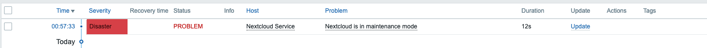

Выключаем maintenance mode:

```bash
docker exec -u www-data -it nextcloud bash
php occ maintenance:mode --off
exit
```

Проблема исчезает или помечается как решённая.

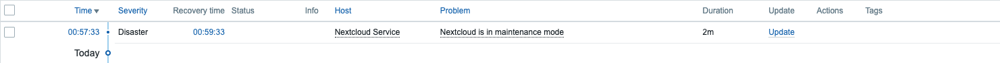

---

## Часть 3: Визуализация

### Шаг 1: Установка плагина Zabbix для Grafana

Плагин уже установлен через переменную окружения `GF_INSTALL_PLUGINS` в docker-compose, но активируем его вручную.

Перезапускаем Grafana:

```bash
docker restart grafana
```

### Шаг 2: Активация плагина Zabbix

Заходим в Grafana (`http://localhost:3000`), идём в **Configuration → Plugins**, находим Zabbix и нажимаем **Enable**.

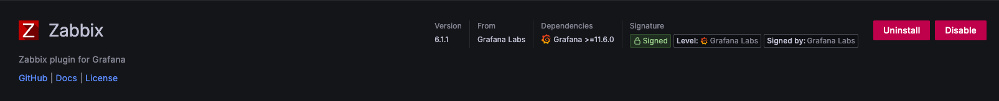

**Проблема с плагином Zabbix**: Сначала плагин вообще не открывался при попытке добавить Data Source — выдавал ошибку React. Потом даже после активации не получалось добавить Zabbix как источник данных. Нашли на форуме ответ, что в Zabbix 6.4 изменился параметр API с `user` на `username`, но плагин для Grafana 11.2.0 ещё не обновлён. Решение — откатиться на Grafana 7.5.17, где всё работает стабильно.

### Шаг 3: Подключение Loki как Data Source

Идём в **Configuration → Data Sources → Add data source**, выбираем **Loki**:
- **Name:** `Loki`
- **URL:** `http://loki:3100`

Нажимаем **Save & test**.

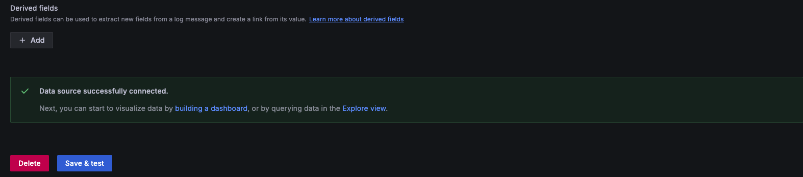

### Шаг 4: Проверка логов через Explore

Идём в **Explore**, выбираем **Loki**, вводим запрос:

```
{job="nextcloud_logs"}
```

Нажимаем **Run query** и видим логи.

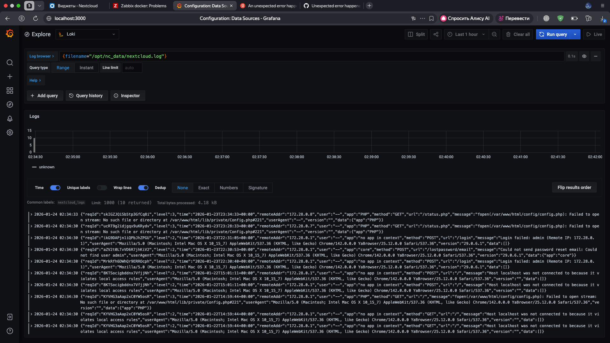

### Шаг 5: Создание дашборда

Идём в **Dashboards → New → New Dashboard → Add new panel**.

Выбираем Data Source: **Loki**, вводим запрос `{job="nextcloud_logs"}`, в **Panel Title** пишем `Nextcloud Logs`, выбираем визуализацию **Table** (или **Logs** если доступна).

Нажимаем **Apply**.

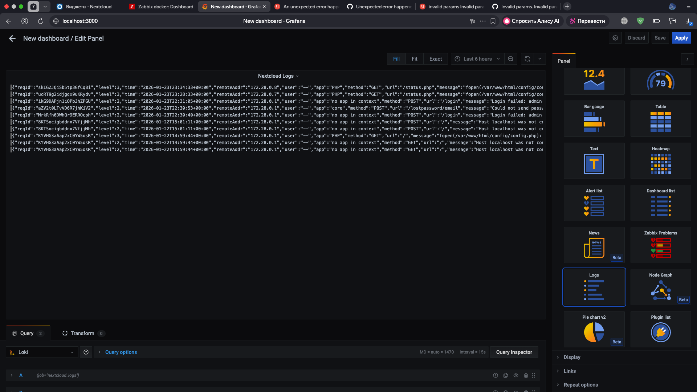

Сохраняем дашборд с названием `Nextcloud Monitoring`.

**Почему не включили визуализацию Zabbix в дашборд**: После долгих попыток с плагином Zabbix (сначала вообще не открывался интерфейс плагина, потом не получалось добавить как Data Source), даже после отката на Grafana 7.5.17, при попытке построить запрос в Explore появлялась ошибка `Invalid parameter "/": unexpected parameter "user"`. Это известная проблема несовместимости Zabbix 6.4 (который использует параметр `username`) и старых версий плагина (которые ожидают `user`). В итоге оставили только визуализацию логов через Loki, так как мониторинг через Zabbix в любом случае работает и доступен через его собственный веб-интерфейс.

---

## Ответы на вопросы

### 1. Чем SLO отличается от SLA?

**Простыми словами**: SLA — это договор с последствиями, SLO — это конкретная цифра, которую нужно достичь.

### 2. Чем отличается инкрементальный бэкап от дифференциального?

**Инкрементальный бэкап** сохраняет только те данные, которые изменились с момента *последнего бэкапа любого типа* (полного или инкрементального). Цепочка получается: полный → инкрементальный 1 → инкрементальный 2 → инкрементальный 3.

**Дифференциальный бэкап** сохраняет все данные, которые изменились с момента *последнего полного бэкапа*. Цепочка: полный → дифференциальный 1 (относительно полного) → дифференциальный 2 (тоже относительно полного).

**Плюсы и минусы**:
- Инкрементальный: быстрее создаётся, занимает меньше места, но восстановление дольше (нужно применять все инкременты по цепочке).
- Дифференциальный: занимает больше места (дублирует одни и те же изменения), но восстановление быстрее (нужен только полный + последний дифференциальный).

### 3. В чем разница между мониторингом и observability?

**Мониторинг** — это процесс сбора и отслеживания заранее определённых метрик и проверок (например, "CPU загружен на 80%", "сервис отвечает"). Вы знаете, что именно хотите проверить, и настраиваете алерты на известные проблемы.

**Observability (наблюдаемость)** — это способность системы отвечать на *неожиданные* вопросы о её состоянии через логи, метрики и трассировки. Вы можете исследовать систему постфактум и понять, что пошло не так, даже если заранее не настроили под это мониторинг.

---

## Выводы

В ходе работы мы:
- Настроили полноценный стек логирования: Nextcloud → Promtail → Loki → Grafana
- Настроили мониторинг с помощью Zabbix: отслеживание статуса Nextcloud и автоматические алерты при переходе в maintenance mode
- Визуализировали логи в Grafana (визуализацию Zabbix не удалось подключить из-за проблем совместимости версий)
- Столкнулись с серьёзными проблемами несовместимости: Grafana 11.2.0 и плагин Zabbix, затем Zabbix 6.4 API и старые версии плагина. Решили откатом на Grafana 7.5.17, но полностью интегрировать Zabbix в Grafana всё равно не получилось
