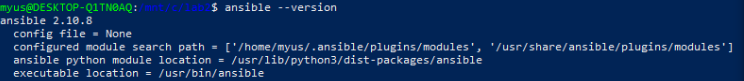
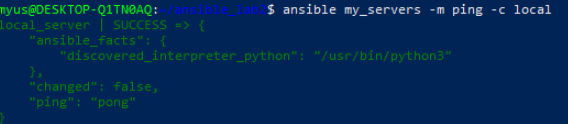
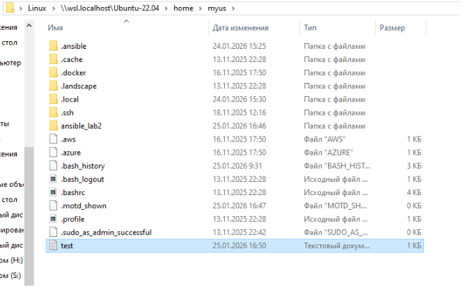
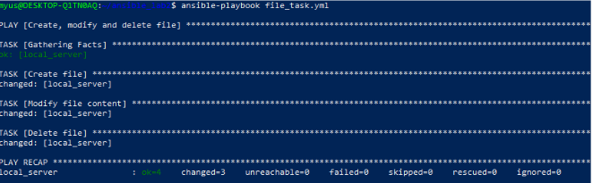

# Лабораторная работа №2: Ansible + Caddy
## Часть 1: Работа с Ansible

### 1. Установка Ansible

### 2. Проверяем, что ansible установлен правильно:


### 3. Создаем текстовый файл с произвольным содержимым, через модуль shell и убеждаемся в работе asnible:



### 4. Создаем playbook для работы с файлом, заполняем file_task.yml:
```
---
- name: Create, modify and delete file
  hosts: my_servers
  connection: local

  tasks:
    - name: Create file
      copy:
        dest: "{{ ansible_env.HOME }}/test.txt"
        content: "Initial content"

    - name: Modify file content
      copy:
        dest: "{{ ansible_env.HOME }}/test.txt"
        content: "Modified content"

    - name: Delete file
      file:
        path: "{{ ansible_env.HOME }}/test.txt"
        state: absent
```
Проверяем:



## Часть 2. Установка Caddy:
### 1. Инициализируем исходное конфигурационное “дерево”:

### 2. Устанавливаем переменные в vars:
```
---
domain_name: "localhost"
log:
  file: /var/log/caddy_access.log
  level: "INFO"
```

### 3. Шаблон Caddyfile
```
{{ domain_name }} {
    root * /usr/share/caddy
    file_server

    header {
        X-Custom-Header "Hello from Ansible Caddy"
    }

    log {
        output file {{ log.file }}
        format json
        level {{ log.level }}
    }
}
```
### 4. Создание роли, заполняем main.yml:
```
---
- name: Install prerequisites
  apt:
    pkg:
      - debian-keyring
      - debian-archive-keyring
      - apt-transport-https
      - curl
    state: present
    update_cache: yes


- name: Add key for Caddy repo
  apt_key:
    url: https://dl.cloudsmith.io/public/caddy/stable/gpg.key
    state: present
    keyring: /usr/share/keyrings/caddy-stable-archive-keyring.gpg


- name: Add Caddy repo
  apt_repository:
    repo: "deb [signed-by=/usr/share/keyrings/caddy-stable-archive-keyring.gpg] https://dl.cloudsmith.io/public/caddy/stable/deb/debian any-version main"
    state: present
    filename: caddy-stable


- name: Install Caddy
  apt:
    name: caddy
    state: present
    update_cache: yes


- name: Create index.html
  copy:
    dest: /usr/share/caddy/index.html
    content: "<h1>Hello world from Caddy on localhost!</h1>"
    owner: www-data
    group: www-data
    mode: '0644'


- name: Create Caddy config from template
  template:
    src: templates/Caddyfile.j2
    dest: /etc/caddy/Caddyfile


- name: Reload Caddy service
  service:
    name: caddy
    state: reloaded

```

### 5. Создаём плейбук (caddy_deploy.yml):

- name: Deploy and configure Caddy on localhost
  hosts: my_servers
  connection: local
  roles:
    - caddy_deploy

### 6. Запускаем и проверяем


### Вывод

1. Проверена работа Ansible на localhost

2. Создан и удалён тестовый файл через playbook

3. Установлен Caddy через Ansible

4. Создан кастомный index.html

5. Настроен Caddyfile через шаблон Jinja2

6. Cadyy поднят, исправно работает